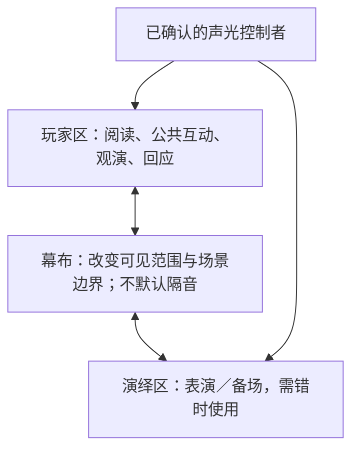

# 单房间的空间、人员与声光执行

默认条件来自用户：一个房间，幕布隔出演绎区和玩家区，音乐与灯光可控制。以下为设计与执行约束，未知设备能力不作事实。

## 三张图要同时成立

| 层面 | 要说明什么 | 常见混淆 |
|---|---|---|
| 实际空间 | 人、幕布、道具在两区哪一侧，谁能看见/听见 | 故事里“走到门外”被安排成真实走廊演出 |
| 故事空间 | 当前地点与年代；对话、回忆还是旁白 | 同一台面上合演不同时间，被解释成角色同时在场 |
| 信息空间 | 玩家看到什么、角色因此可知道什么、秘密属于谁 | 玩家看过临终回忆，就被要求角色当时立即救人 |

把虚构远行、门外守护或异地会面翻译为帘前/帘后站位、口述、声音或同区时间切换。没有确认的出口、黑屋、侧台或换装间不写入必需动作。

## 幕布与焦点

| 状态 | 合理用途 | 必须解决的交接 |
|---|---|---|
| 闭幕，焦点在玩家区 | 阅读、NPC 互动、递卡；另一演员安静备场 | 备场响动和台词是否提前泄露；陪场与控台由谁负责 |
| 开幕，焦点在演绎区 | 观看、揭晓、邀请上台 | 先确认演员道具就绪；玩家能看见；谁把话交给玩家 |
| 开幕，焦点回玩家区 | 看完后的回应、物件递交 | 不能在观众仍看见时偷偷换装；舞台演员停留做什么 |
| 闭幕后的转换 | 换装、恢复道具、下一段准备 | 闭幕前人手和路线已安排；闭幕后仍听得见的声音如何解释 |

开幕只有一次有意义的揭示时就使用一次；不把每段都机械写成“关灯—拉幕—开灯”。没有分区灯时，演员朝向、站位、停顿与台词可承担焦点转移。不要把某种颜色永久绑定为某种心理效果。

## 私密信息与同时进行的任务

幕布只能作为视线边界。对单人递送私密信息，可用不被他人看见的纸卡/低声简短提示，并确认玩家能阅读、不必大声复述；若必须长谈且不能被听见，当前房间条件不足，需要改为私读或先询问实际可用条件。

音乐只能在一定程度上遮盖轻微杂音，不能据此承诺保密，更不能提高音量盖过正在说话的人。一个公共房间通常同一时刻只有一个主要可听焦点；两组长对话同时进行会互相干扰。

## 演员与操作人员是稀缺资源

每段按实际人而非角色名排程。同一人扮演的两个角色不能同时即时对话。需要时让前一个退出、换装完成后再进入，或用明确的旁白/时间转换；录音只在确有资源时采用，并且不能假装会按任意现场回答变化。

若没有独立控台，把音乐播放、灯光和拉幕也分配给现有演员。演员正在面对玩家表达、双手递物或换装时，不安排同时操作幕布与设备。无法兼顾就减少技术变化，或让剧情停在一个自然等候点。

用这种表提前暴露冲突：

| 阶段 | 玩家区与其他玩家 | 演绎区 | 演员甲 | 演员乙（若有） | 控制者与动作 |
|---|---|---|---|---|---|
| 准备 | 玩家知道等待什么 | 布置是否可被看见/听见 | 陪场或备场 | 陪场或备场 | 谁确认就绪 |
| 焦点互动 | 谁说、谁看、谁递物 | 演出或留空 | 当前身份/位置 | 当前身份/位置 | 是否需要操作 |
| 交接 | 下一位如何知道轮到自己 | 是否腾空可换装 | 收尾动作 | 接手动作 | 下一提示的触发者 |

不默认演员乙存在。单演员时，备场在玩家阅读前完成；用预先放好的道具与简化声光减少离场需求。幕布需人在两端操作等限制，必须以实际装置为准。

## 提示表用事件驱动

每条提示包含：编号、执行者、预备条件、可观察触发、动作、等待状态、错过时处理。

| 编号 | 预备条件 | 触发 | 执行者与动作 | 若未触发或失效 |
|---|---|---|---|---|
| C01 | 主持确认玩家读完；演员、道具就绪 | 主持给出约定信号 | 指定控制者淡出读本音乐，保持可见照明 | 有人仍在读则等候；不提前交关键剧情 |
| C02 | 玩家已完成本段表达 | 主持收尾句结束且台前无人继续说 | 指定人员调整音乐/开幕；演员进入新场景 | 玩家继续说则留在等待状态；漏播就口述衔接 |
| C03 | 道具已交给指定人 | 接物者确认接到 | NPC 发出下一邀请 | 没拿到则补交；不能按音轨强行跳过 |

“准备好了”信号是给工作人员的，不应让玩家听见剧情秘密。不能保证唯一台词出现时，以等价语义或明确主持信号作为触发。已经执行的声光提示要标记完成，避免再次触发同一出场。

固定音轨段可写时间码；开放问答段需能暂停、循环或由人决定切换。音乐文件、版本和起止位置只有在确认存在时写作已备资源，否则列为待配置，不虚构歌单可用性。

## 技术失效时保住什么

- 音乐没响：保住人物目标、玩家回应与信息交接；可用停顿、台词和表演节奏继续。若音乐本身是解谜证据，则暂停并提供等价已核准线索。
- 灯光无法分区：维持可见照明，用站位和称呼标焦点。不要依赖玩家在黑暗中找路或偷偷换位。
- 幕布不能操作：取消视觉突现，改为明确口述后演员转身/进入。若秘密道具还裸露，先暂停整理，再进入揭晓。
- 演员未备好：停在可结束的小互动或阅读状态，不无限追问同一位玩家填时间；说明最晚可用的替代入口。
- 玩家提前进入演绎区或揭开信息：先处理实际状态，确认看见什么；用已知事实继续或暂停澄清，别宣称曝光从未发生。

缩减预算时先减少换装、装置、额外道具和音乐切换，保留必要人物行为与玩家回应。最低技术版本应仍说得清本段为何值得发生。
